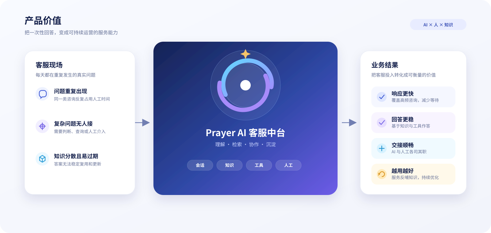
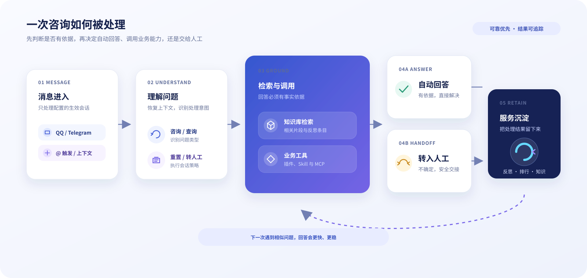
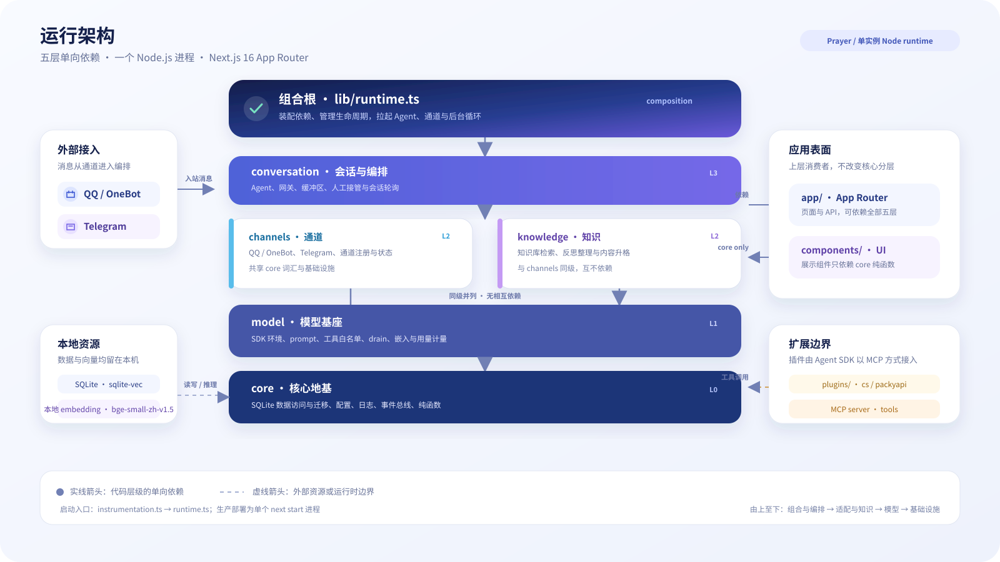
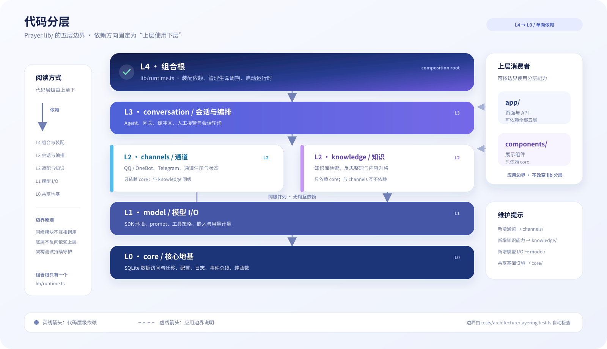
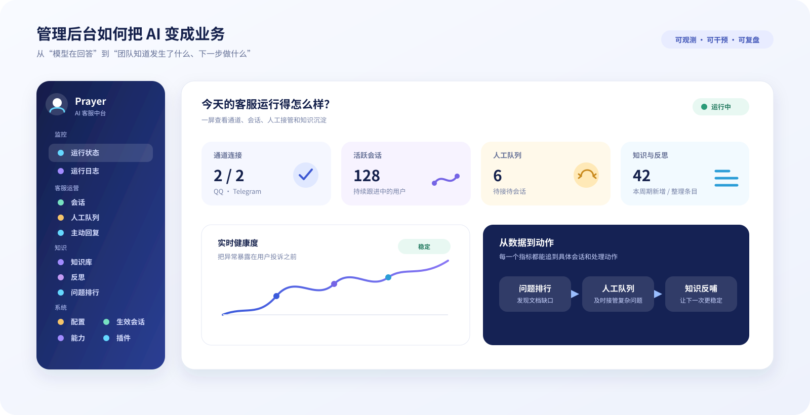
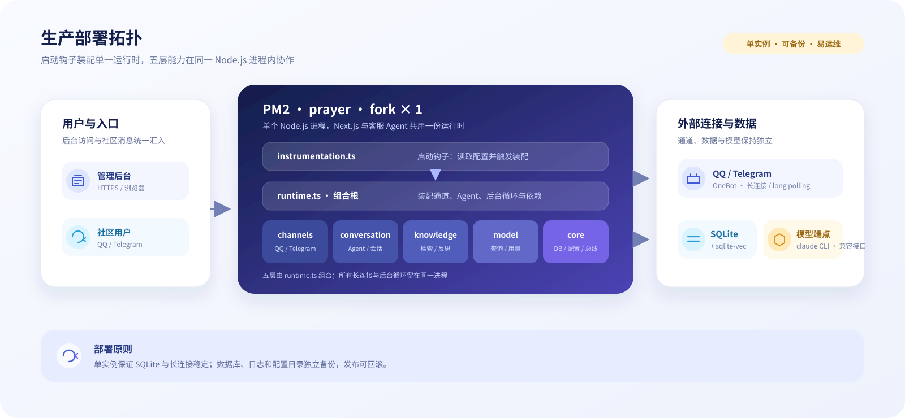

# Prayer

## 多渠道 AI 客服中台

> 把重复问答交给 AI，把复杂问题交给人工，把每一次服务沉淀成下一次更好的答案。

<p align="center">
  
  <br />
  <strong>Prayer</strong>
</p>

Prayer 面向需要在 QQ、Telegram 等社区场景持续提供产品咨询的团队。它不是一个只能“聊天”的机器人，而是一套围绕客服业务设计的运行系统：接入真实会话，基于知识库回答，必要时调用业务能力或转人工，并把服务过程持续沉淀为可复用的知识资产。

## 产品价值

<p align="center">
  
</p>

<p align="center">
  <a href="#核心能力">核心能力</a> ·
  <a href="#快速开始">快速开始</a> ·
  <a href="#管理后台">管理后台</a> ·
  <a href="#生产部署">生产部署</a>
</p>

## 为什么是 Prayer

传统客服机器人往往停留在“接收消息 → 生成回复”，上线后很快会遇到三个问题：回答缺乏依据、复杂问题没人接、知识无法随着业务变化更新。

Prayer 把这三个问题做成了产品闭环：

| 客服现场                   | Prayer 的处理方式                                 |
| -------------------------- | ------------------------------------------------- |
| 用户在群里提问             | 只在配置的生效会话中响应，支持 @ 触发与会话上下文 |
| 问题需要事实依据           | 自动检索知识库，将相关内容注入回答流程            |
| 需要查价格、状态或业务数据 | 通过插件、Skill 和 MCP 接入业务工具               |
| AI 无法可靠处理            | 转入人工队列，暂停该会话的自动回复                |
| 人工给出了新答案           | 自动提炼为反思条目，整理、去重并可升格为正式知识  |

### 核心能力

- **多渠道接入**：QQ（OneBot / NapCat）与 Telegram 共用一套客服编排、会话、知识和运营能力。
- **有依据的回答**：本地知识库、向量检索和预检索机制协同工作，减少“看起来合理但没有依据”的回答。
- **业务能力扩展**：通过插件、Skill 和 MCP 连接价格、公告、账户等业务工具，不把业务逻辑硬编码在客服主流程里。
- **人机协作**：支持转人工、人工队列、会话挂起与恢复，人工处理完成后可一键恢复自动答。
- **持续学习**：从已沉淀会话中提取 FAQ，自动合并近义内容、清理过时条目，并按需升格为正式知识。
- **谨慎主动补位**：在无人应答时主动识别未处理问题；只有检索到明确依据且足够有把握时才回复，优先避免刷屏和误答。
- **可运营、可审计**：运行状态、会话、人工队列、知识库、问题排行、用量、日志、插件和通道状态集中在管理后台。

### 品牌与业务分离

Prayer 是默认平台品牌，不预设部署方一定经营某个产品。品牌名称和简介可在 `/admin/config` 的「品牌」页签中修改；主 Agent、意图分类、主动补位、问题归类与后台标题会使用同一份配置。产品事实来自部署方知识库，价格、状态、公告等实时能力由启用的业务插件提供。

仓库中的 `packyapi` 是一个可选业务插件示例。启用它时可以查询 PackyAPI 的实时数据；停用或替换它不会改变 Prayer 的平台身份。

## 一次咨询如何被处理

<p align="center">
  
</p>

Prayer 的关键不是让模型“尽量回答”，而是让每一次回答都经过依据判断：有依据就自动解决，需要业务数据就调用工具，不确定就安全转人工，最终把结果沉淀下来。

## 运行架构

<p align="center">
  
</p>

### 代码分层

运行架构图展示的是代码边界，而不是进程数量。Prayer 的 `lib/` 只有一个组合根；其余模块按职责分层，依赖方向固定为“上层使用下层”：

<p align="center">
  
</p>

`channels` 与 `knowledge` 是同级模块，互不依赖；`conversation` 可以组合所有下层能力，`runtime.ts` 负责装配生命周期。`app/` 页面和 API 可以依赖全部层，`components/` 只依赖 `components/` 自身与 `lib/core/`。这些边界由 [`tests/architecture/layering.test.ts`](tests/architecture/layering.test.ts) 自动检查，旧的 `lib/agent`、`lib/db`、`lib/config`、`lib/tools` 和 `lib/onebot` 路径已退役。

新增能力按下面的落位规则放置：

| 需求                                   | 落位                                                          |
| -------------------------------------- | ------------------------------------------------------------- |
| 新消息通道                             | `lib/channels/<channel>/`，并在 `registry` / `factory` 中注册 |
| Agent、会话与编排                      | `lib/conversation/`                                           |
| 知识库、反思与知识升格                 | `lib/knowledge/`                                              |
| SDK 调用、embedding、工具策略与用量    | `lib/model/`                                                  |
| 数据库、配置、事件总线与共享展示纯函数 | `lib/core/`                                                   |
| 进程启动与运行时装配                   | `lib/runtime.ts`                                              |

### 客服闭环

实际运行时，Prayer 将每条消息纳入统一的会话编排：

1. **接入**：从 QQ 或 Telegram 收到消息，按生效会话白名单和触发规则筛选。
2. **理解**：恢复会话上下文，识别普通咨询、业务查询、重置或转人工意图。
3. **检索**：从知识库和反思条目中查找相关依据，必要时调用业务工具。
4. **响应**：发送简洁答复；无法可靠处理时进入人工队列，而不是编造答案。
5. **沉淀**：将人工解答和高频问题沉淀为可检索、可治理的知识资产。

## 管理后台

启动服务后访问 `/admin`。后台配置保存后会触发运行时重新装配，通道、定时任务和 Agent 会按新配置重新生效。

| 页面                  | 用途                                                 |
| --------------------- | ---------------------------------------------------- |
| `/admin`              | 运行状态、通道连接、会话数量、人工队列和今日业务结果 |
| `/admin/logs`         | 运行日志与异常排查                                   |
| `/admin/sessions`     | 历史会话、消息记录和会话重开                         |
| `/admin/handoff`      | 待处理人工会话，处理完成后恢复自动答                 |
| `/admin/proactive`    | 主动补位记录与结果                                   |
| `/admin/kb`           | 知识文档管理、编辑和向量摄入                         |
| `/admin/reflection`   | 反思条目、整理进度和知识升格                         |
| `/admin/ranking`      | 高频问题排行，帮助团队发现产品与文档缺口             |
| `/admin/config`       | QQ、Telegram、回复体验、会话、反思、通知和存储路径查看（DB_PATH 只读） |
| `/admin/groups`       | 生效会话、活动量和会话级策略覆盖                     |
| `/admin/capabilities` | 当前 Agent 的插件、Skill、MCP 与工具能力             |
| `/admin/plugins`      | 插件安装、更新、启停和重载                           |

<p align="center">
  
</p>

开发环境可省略 `ADMIN_TOKEN`；生产环境必须设置，否则管理后台和 `/api` 会 fail-closed。

## 技术底座

Prayer 以单个 Node.js 进程运行 Next.js 管理后台和客服 Agent。`instrumentation.ts` 仅在 Node runtime 启动时加载数据库、配置和 `lib/runtime.ts`，由组合根装配通道、会话编排、知识循环与模型能力；因此启动一个生产服务进程即可同时获得：

- QQ / Telegram 通道连接与消息分发
- Agent 会话编排、知识检索、工具调用与人工接管
- 反思、整理、知识升格、主动补位和问题排行等后台循环
- 管理后台 API 与实时状态
- SQLite 业务数据与 sqlite-vec 向量索引

核心技术栈：

- **Runtime**：Node.js 24、Next.js 16、React 19
- **Agent**：`@anthropic-ai/claude-agent-sdk`，模型通过 Anthropic-compatible provider 接入
- **知识与存储**：better-sqlite3、sqlite-vec、本地 embedding
- **管理界面**：shadcn/ui、Tailwind CSS
- **进程管理**：PM2 fork 单实例

## 快速开始

### 环境要求

- Node.js `24.16.0` 或兼容的 Node.js 24 版本
- pnpm `11`
- 能够运行 Claude Agent SDK 所需的本地 `claude` 可执行文件
- 至少配置一个消息通道：QQ 或 Telegram

### 1. 安装依赖

```bash
pnpm install --frozen-lockfile
cp .env.example .env
```

### 2. 配置模型服务

模型、Anthropic-compatible endpoint 和鉴权 token 不放在 `.env`，而是写入 `CLAUDE_CONFIG_DIR/settings.json`。默认路径为 `./data/claude-config/settings.json`，也可以通过 `CLAUDE_CONFIG_DIR` 指定其他目录。

示例：

```json
{
  "env": {
    "ANTHROPIC_BASE_URL": "https://your-anthropic-compatible-endpoint",
    "ANTHROPIC_AUTH_TOKEN": "replace-with-your-token",
    "ANTHROPIC_MODEL": "your-model-id"
  }
}
```

该文件包含明文凭证，已被 Git 忽略。不要提交到仓库，也不要把 token 写进 README、日志或截图。

### 3. 准备知识库

将 Markdown 等知识文档放入 `docs/kb/`，然后执行：

```bash
pnpm ingest
```

摄入过程会生成本地 embedding 并写入生产 SQLite 的 sqlite-vec 索引；执行前后可用只读
`pnpm kb:freshness` 核对文件、分块和向量维度，报告失败时应先取得授权再做受控重建。
生产重建前请暂停 PM2/后台写入任务，避免 CLI 与运行中的进程并发修改索引。
`docs/kb/_archive/` 中的可见 Markdown/TXT 不会进入生产入库。`docs/kb/` 默认不纳入版本
控制，生产环境建议使用受控目录、挂载卷或通过管理后台维护。

### 4. 构建并启动

```bash
pnpm build
pnpm start
```

访问 <http://localhost:3000/admin>，在配置页完成通道、生效会话和管理面设置。

> `pnpm dev` 只适合开发管理后台。生产客服 Agent 依赖真实 Node runtime 和本地 `claude` 可执行文件，生产环境必须使用 `pnpm build && pnpm start` 或 PM2。

## 通道配置

### QQ / OneBot

1. 在 NapCat 中开启“正向 WebSocket 服务器”。
2. 将监听地址填入 `ONEBOT_WS_URL`，默认示例为 `ws://127.0.0.1:3001`。
3. 如启用鉴权，填写 `ONEBOT_ACCESS_TOKEN`。
4. 配置机器人 QQ 号 `BOT_QQ`，并在 `/admin/config` 选择生效群。
5. 需要接收转人工通知时，配置 QQ 管理面；管理面只处理管理命令，不参与客服问答。
6. 在生效群中 @ 机器人发送测试问题。

### Telegram

1. 通过 BotFather 创建 Bot，并获取 `TELEGRAM_BOT_TOKEN`。
2. 将 Bot 加入目标群或超级群，在 `/admin/config` 中填写生效 chat id。
3. 如需反思和主动补位读取完整群消息，关闭 BotFather 的 Group Privacy Mode。
4. Telegram 使用 long polling，同一个 Bot token 只能由一个生产进程消费；不要运行多个副本。

Telegram chat id 必须按字符串保存，尤其是超级群的负数 id，不要在外部配置流程中转成 JavaScript `Number`。

## 配置分层

环境变量用于首次启动时提供种子值；保存后的业务配置持久化在 SQLite 中，并可在管理后台修改。模型凭证始终由 `settings.json` 管理。

`DB_PATH` 是部署级存储边界，管理后台中的存储路径只读；迁移数据库时请停机、备份并在部署环境修改 `DB_PATH`，再按[数据库迁移与备份](docs/database-operations.md)验证，不支持在线搬库。
通常应填写普通文件路径；也接受不带 query/fragment 的本机绝对 `file:` URI。SQLite URI
选项和远程/相对 `file:` URI 会被拒绝，避免把只读等 URI 语义静默改成普通文件打开。

常用环境变量：

| 变量                     | 作用                                                                     |
| ------------------------ | ------------------------------------------------------------------------ |
| `BRAND_NAME`             | 首次启动时的品牌名称，默认 `Prayer`                                      |
| `BRAND_DESCRIPTION`      | 首次启动时的品牌/业务简介                                                |
| `CLAUDE_CONFIG_DIR`      | Agent SDK 配置目录，默认 `./data/claude-config`                          |
| `DB_PATH`                | SQLite 数据库路径，默认 `./data/agent.db`                                |
| `ONEBOT_WS_URL`          | QQ / OneBot 正向 WebSocket 地址                                          |
| `ONEBOT_ACCESS_TOKEN`    | OneBot 鉴权 token，可选                                                  |
| `BOT_QQ`                 | QQ 机器人账号                                                            |
| `TELEGRAM_BOT_TOKEN`     | Telegram Bot token                                                       |
| `TELEGRAM_ENABLED_CHATS` | 首次启动时种子的 Telegram chat id 列表，逗号或空格分隔                   |
| `ADMIN_GROUP_ID`         | 首次启动时种子的 QQ 管理面                                               |
| `ADMIN_TOKEN`            | 管理后台和 API 的访问口令；开发可省略，生产必填（缺失时 fail-closed）    |
| `PRAYER_MCP_ALLOWLIST`   | 额外显式放行的完整 MCP 工具名（逗号/空格分隔）；默认仅 CS/Packy 查询工具 |
| `TRUST_PROXY`            | 仅可信反向代理已规范化 `X-Forwarded-For`、`X-Forwarded-Host`、`X-Forwarded-Proto` 时设为 `true`，用于登录限速和 Cookie 请求的 Origin 校验 |
| `PRAYER_BACKUP_PATHS`    | 供权限审计检查的显式备份文件路径，不会递归扫描                           |
| `HANDOFF_TIMEOUT_MIN`    | 转人工超时后恢复自动答的分钟数                                           |
| `RESUME_TTL_MS`          | 会话续接空闲时间，设为 `0` 关闭过期                                      |
| `KB_PREFETCH_ENABLED`    | 是否在每轮消息前自动预检索，默认开启                                     |
| `PROACTIVE_ENABLED`      | 是否开启无人应答主动补位，默认关闭                                       |
| `SUPPORT_URL`            | 无法处理业务时展示的支持链接                                             |
| `MAX_REPLY_CHARS`        | 单条回复拆分上限，`0` 表示不拆分                                         |
| `USAGE_BUDGET_USD`       | 日用量预算，`0` 表示不告警                                               |

反思、整理、知识升格、主动补位和主题排行的完整参数见 [`.env.example`](.env.example)，也可以在 `/admin/config` 中调整。

## 生产部署

### PM2

项目已提供单实例 fork 配置 `ecosystem.config.cjs`：

```bash
pnpm pm:start     # 构建并启动
pnpm pm:status    # 查看状态
pnpm pm:logs      # 查看实时日志
pnpm pm:restart   # 停止、重新构建并启动
pnpm pm:stop      # 停止但保留进程配置
pnpm pm:delete    # 从 PM2 移除
```

<p align="center">
  
</p>

Linux 上可使用 systemd 配置开机自启：

```bash
pnpm pm:enable
pnpm pm:disable
```

### 部署边界

- 必须使用标准 Node.js server runtime，不支持 Vercel、Edge Function 或其他 serverless 运行方式。
- PM2 必须保持 `instances: 1` 和 `fork` 模式：better-sqlite3 是 native 依赖，通道包含长连接 / long polling。
- Telegram 同一 Bot token 不支持多实例消费。
- 发布前应备份 SQLite 数据库；可使用 `pnpm db:check` 和 `pnpm db:backup`。备份命令是
  一次性的本机原子备份，目标文件不得已存在；仓库不替部署方提供自动 cron、异地复制或
  恢复演练。
- 外部访问管理后台时，生产必须配置 `ADMIN_TOKEN`，并同时启用 HTTPS、反向代理访问控制和最小化开放端口。
- `/health/live` 只表示进程存活；`/health/ready` 会在必需通道未连接或启动失败时返回 `503`，可直接接入负载均衡健康检查。
- 生产环境请将 `.env`、`settings.json`、SQLite 数据库/WAL/备份限制为 `0600`（仅进程用户
  可读），并在部署前轮换凭据；`pnpm security:permissions` 默认只读审计，只有显式
  `--apply` 才会修改已列出的普通文件，应用不会替你修改现有主机权限。
- 插件管理 CLI 只继承定位 CLI、配置和临时目录所需的安全环境白名单；插件仍属于第三方代码，Claude 配置中的 hooks / `env` 可能继续向其注入权限，因此公开的不受信任插件仍需独立低权限隔离。

## 开发与验证

```bash
pnpm dev          # 开发管理后台
pnpm typecheck    # TypeScript 检查
pnpm lint         # ESLint
pnpm test         # Vitest
pnpm check        # typecheck + lint + test
pnpm kb:freshness # 只读核对 docs/kb 与 SQLite 分块/向量是否一致
pnpm security:permissions # 只读审计；确认后用 `pnpm security:permissions -- --apply` 收紧到 600
pnpm db:retention # 默认只读预览；确认备份后用 `--apply` 清理过期数据
```

涉及页面、路由或生产边界时，使用独立构建目录，避免覆盖正在运行的 `.next`：

```bash
NEXT_DIST_DIR=.next-verify pnpm build
```

更完整的模块边界、测试约定、数据库迁移与备份流程见：

- [开发与代码质量](docs/development.md)
- [数据访问层](docs/data-access.md)
- [数据库迁移与备份](docs/database-operations.md)

## 项目结构

```text
app/                    管理后台页面与 API 路由
components/             管理后台与通用 UI 组件
lib/core/               L0 共享地基：db、config、chat 词汇、日志、总线与展示纯函数
lib/model/              L1 模型基座：SDK、embedding、工具策略、prompt 与用量
lib/channels/           L2 QQ / Telegram 通道实现、registry 与生命周期
lib/knowledge/          L2 知识库与反思：检索、压缩、升格
lib/conversation/       L3 会话与编排：Agent、网关、缓冲区、人工接管与后台循环
lib/runtime.ts          L4 组合根：装配全部运行时能力
plugins/                本地业务插件、Skill 与 MCP server
scripts/                知识库摄入、数据库维护脚本
docs/kb/                业务知识源文件（默认不入 Git）
docs/assets/            README 与产品文档视觉素材
data/                   运行时数据库与 SDK 配置（默认不入 Git）
logs/                   PM2 与运行日志（默认不入 Git）
tests/architecture/     分层与旧路径退役护栏
```

## 当前边界

Prayer 的设计目标是可控、可解释、可运营的社区客服，不是无限制的通用聊天机器人。生产上线前请至少完成：知识库审核、人工接管演练、通道权限检查、数据库备份恢复演练、管理后台鉴权和用量预算设置。

当前正式支持 QQ / OneBot 和 Telegram；Discord 仅预留通道类型，尚未提供生产适配器。
